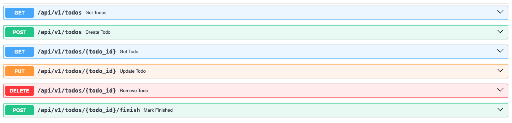

# Todo with FastAPI
**Robert Theo**

### Requirement:
##### 1. Docker
##### 2. FastAPI


### Installation :
##### 1. Docker build :
```sh
$ docker build -t my-fastapi-app .
```
##### 2. Docker run :
```sh
$ docker run -p 80:80 my-fastapi-app
```

##### 3. Open [/docs](https://todo-fastapi-293463637151.asia-southeast2.run.app/docs) for the documentation (Swagger)



